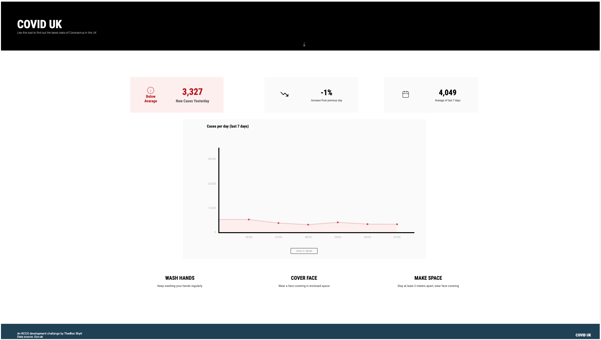

# Vue simple-app

## Objective 
To build a single-page Vue project where the main task is to
pull some data via an API request and display it through a chart.

## Skills and technical aspects to focus on

* Retrieving data form the GOV.UK API
* Displaying the data using VUE
* Using chart.js to show the data in graph
* Making the web-page responsive in all device sizes
* Reproducing the data displayed from an already given mockup 

### [Web-page link](https://www.theodhorshyti.com/FirstVue/index.html)
